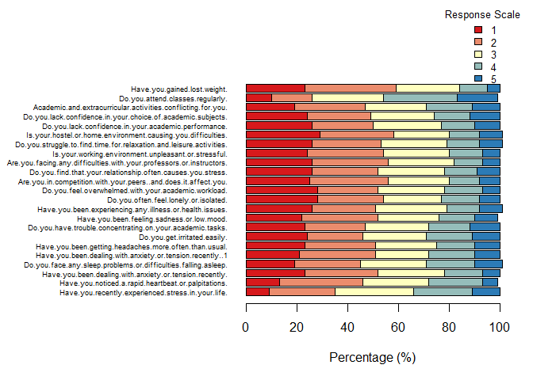
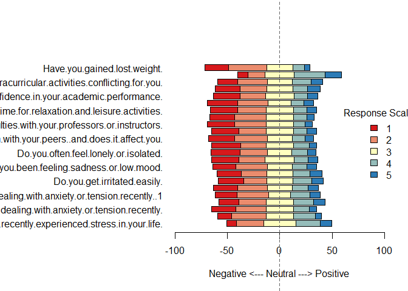
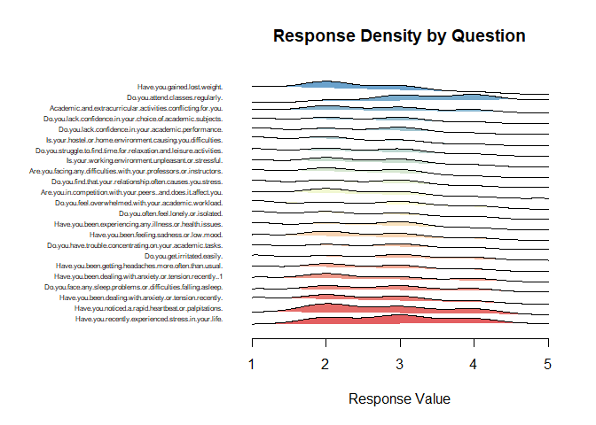
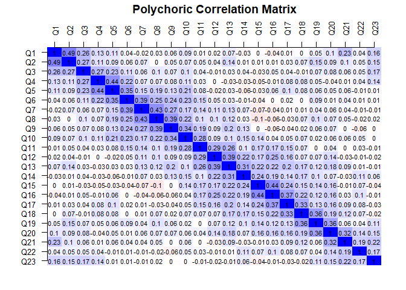
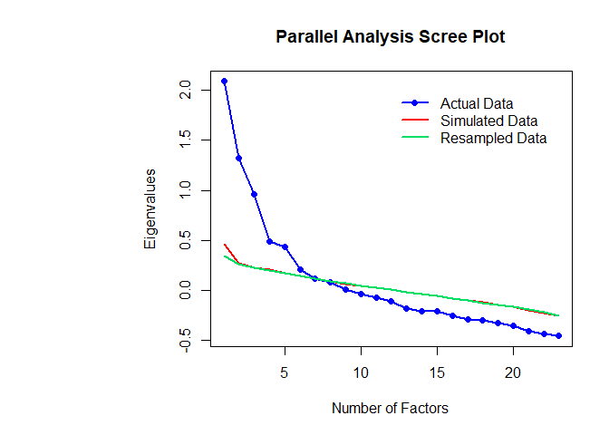

<!-- README.md is generated from README.Rmd. Please edit that file -->

# likertr

<!-- badges: start -->

<!-- badges: end -->

`likertr` provides a comprehensive workflow for a full-scale analysis of
Likert-scale data. The package facilitates the following processes:

## 1. Data Preparation and Cleaning

- **Handling specific responses:** Dealing with “neutral,” “do not
  know,” or “do not wish to answer.”
- **Recoding:** Center weighting or setting values to `NA`.

## 2. Reliability Measures and Structure Information

- **Consistency Metrics:** Cronbach’s alpha and McDonald’s omega.
- **Exploratory Factor Analysis (EFA):**
  - **Kaiser-Meyer-Olkin (KMO):** A test to see if the items share
    enough variance.
  - **Bartlett’s Test of Sphericity:** A test to confirm the correlation
    matrix isn’t just random noise.
  - **Polychoric Correlation Matrix:** Treats Likert categories as
    ordinal rather than continuous.
- **Relative Importance Index (RII):** A method to rank the importance
  of survey questions against each other.

## 3. Visualization

- **Diverging stacked bar charts:** The standard for Likert scale
  visualization.
- **Heat maps:** Specifically for correlation matrices.
- **Comparison plots:** Useful for group-to-group analysis.

## 4. Inference and Reporting

- **Nonparametric testing:** Utilizing Mann-Whitney U or Kruskal-Wallis
  tests.
- **Effect size calculation:** Providing Cliff’s Delta or $r$ for robust
  interpretation. \## Installation

You can install the development version of likertr from
[GitHub](https://github.com/) with:

``` r
# install.packages("pak")
pak::pak("laurenlaturner/likertr")
```

## Example Workflow

Three main functions in Likertr provide all required functionality. The
function “likertr()” is used to create a likertr object that can then be
passed to summary() and plot() generics.

``` r
library(likertr)

load("data/data.rda")

analysis <- likertr(data)
#> Loading required namespace: GPArotation
#> No item grouping specified. Cronbach's Alpha calculated assuming all items in same group.
summary(analysis)
#> ================================================
#> LIKERTR OBJECT SUMMARY REPORT
#> ================================================
#> 
#> This dataset contains 23 questions with 842 total observations.
#> 
#> ================================================
#> Pre-EFA (Exploratory Factor Analysis) Diagnostics
#> ================================================
#> 
#> Bartlett's sphericity test does not show problematic results 
#> 
#> The KMO test does not show problematic results 
#> 
#> Polychoric correlation matrix results can be viewed using the 'plot' function
#>  - Lots of very low coefficients in the matrix indicate low factorability
#>  - Lots of very high loadings indicate redundant variables
#> 
#> ================================================
#> EFA Results
#> ================================================
#> 
#> No 'n' argument was given and number of factors (6) used in EFA was determined using parallel analysis
#> 
#> Check parallel analysis Scree plot using 'plot' function for more details
#> 
#> EFA Loadings (Standardized):
#>         MR2     MR1     MR4     MR3     MR5     MR6
#> Q1  -0.0323 -0.0352  0.0426  0.6105 -0.0517  0.1320
#> Q2   0.0177 -0.0169  0.0136  0.6658  0.0879 -0.0555
#> Q3  -0.0075 -0.0124  0.2785  0.3220 -0.0019  0.0271
#> Q4  -0.0196 -0.0293  0.5700  0.1170  0.0087 -0.0397
#> Q5   0.0243  0.0997  0.6376  0.0025  0.0045  0.0065
#> Q6  -0.0129  0.3800  0.3415 -0.0570 -0.0023  0.0135
#> Q7  -0.0255  0.5380  0.0722 -0.0610  0.0289  0.0216
#> Q8  -0.0884  0.5915  0.0484 -0.0467  0.1052  0.0469
#> Q9   0.0482  0.5481 -0.0136  0.0618 -0.0031 -0.0268
#> Q10  0.1911  0.3391  0.1347  0.0497 -0.0856  0.0350
#> Q11  0.4092  0.2494  0.0350  0.0436 -0.1641 -0.0209
#> Q12  0.4498  0.1853 -0.1089  0.0676 -0.0416 -0.0555
#> Q13  0.4670  0.2227 -0.1542  0.1416  0.0214 -0.0045
#> Q14  0.3448  0.1079 -0.1043  0.0292  0.0732 -0.0303
#> Q15  0.5186 -0.1195 -0.0286 -0.0248  0.0619 -0.0037
#> Q16  0.5804 -0.1716  0.1074 -0.0782  0.0570  0.0482
#> Q17  0.4195 -0.1283  0.1657 -0.0635  0.1234  0.0670
#> Q18  0.1975 -0.0425  0.0795 -0.0542  0.3897  0.0383
#> Q19 -0.0148  0.0532 -0.0046  0.0491  0.7080 -0.0143
#> Q20  0.1236  0.0595 -0.0746  0.0097  0.2822  0.3685
#> Q21 -0.0190  0.0206 -0.0144  0.0265 -0.0402  0.6790
#> Q22  0.0818 -0.0686  0.0286 -0.0173  0.0224  0.2839
#> Q23 -0.0837 -0.0186  0.0292  0.1847  0.0352  0.2675
#> 
#> 
#> Variance Explained:
#>                  MR2    MR1    MR4    MR3    MR5    MR6
#> Proportion Var 0.072 0.0648 0.0482 0.0465 0.0383 0.0363
#> Cumulative Var 0.072 0.1367 0.1849 0.2314 0.2697 0.3061
#> 
#> 
#> Communality:
#>     Q1     Q2     Q3     Q4     Q5     Q6     Q7     Q8     Q9    Q10    Q11 
#> 0.4217 0.4524 0.2094 0.3478 0.4439 0.3028 0.3058 0.3747 0.3147 0.2054 0.2477 
#>    Q12    Q13    Q14    Q15    Q16    Q17    Q18    Q19    Q20    Q21    Q22 
#> 0.2528 0.3264 0.1590 0.2913 0.3828 0.2567 0.2405 0.5090 0.3026 0.4578 0.0973 
#>    Q23 
#> 0.1367 
#> 
#> 
#> The following variables have communality values less than 0.2, which means that very little of their variance is explained by the common factors and they should be considered for removal:
#>    Q14    Q22    Q23 
#> 0.1590 0.0973 0.1367 
#> 
#> Factor Correlation Matrix:
#>        MR2    MR1    MR4    MR3    MR5    MR6
#> MR2 1.0000 0.0852 0.0171 0.0493 0.2292 0.0855
#> MR1 0.0852 1.0000 0.1881 0.1119 0.0474 0.0333
#> MR4 0.0171 0.1881 1.0000 0.1393 0.0850 0.0848
#> MR3 0.0493 0.1119 0.1393 1.0000 0.1173 0.2131
#> MR5 0.2292 0.0474 0.0850 0.1173 1.0000 0.2049
#> MR6 0.0855 0.0333 0.0848 0.2131 0.2049 1.0000
#> 
#> 
#> Measures of Fit:
#> RMSEA: 0.0419 
#> This RMSEA value indicates a good model fit
#> 
#> TLI: 0.838 
#> This TLI value indicates a poor model fit
#> 
#> CFI: 0.9172 
#> This CFI value indicates an acceptable model fit
#> 
#> Keep in mind that the interpretation of many of these statistics will depend on the context of your analysis
#> 
#> ================================================
#> Cronbach's Alpha
#> ================================================
#> 
#> Alpha = 0.6861737 
#> 
#> Alpha after removing: 
#> Q1 :      0.6797192 
#> Q2 :      0.6768492 
#> Q3 :      0.678257 
#> Q4 :      0.6800456 
#> Q5 :      0.6740794 
#> Q6 :      0.6742977 
#> Q7 :      0.6769755 
#> Q8 :      0.6748195 
#> Q9 :      0.6744372 
#> Q10 :      0.6702601 
#> Q11 :      0.6733521 
#> Q12 :      0.6754376 
#> Q13 :      0.6677888 
#> Q14 :      0.6781183 
#> Q15 :      0.6803645 
#> Q16 :      0.675394 
#> Q17 :      0.6747907 
#> Q18 :      0.6757493 
#> Q19 :      0.6741497 
#> Q20 :      0.6711004 
#> Q21 :      0.681493 
#> Q22 :      0.6863348 (*)
#> Q23 :      0.6849077 
#> 
#> ================================================
#> Relative Importance Index (RII)
#> ================================================
#> 
#> Q1 :      0.5990499 
#> Q2 :      0.5505938 
#> Q3 :      0.508076 
#> Q4 :      0.5567696 
#> Q5 :      0.5320665 
#> Q6 :      0.5251781 
#> Q7 :      0.539905 
#> Q8 :      0.5394299 
#> Q9 :      0.5163895 
#> Q10 :      0.5092637 
#> Q11 :      0.4988124 
#> Q12 :      0.5002375 
#> Q13 :      0.4964371 
#> Q14 :      0.5023753 
#> Q15 :      0.4888361 
#> Q16 :      0.4971496 
#> Q17 :      0.5028504 
#> Q18 :      0.484323 
#> Q19 :      0.515677 
#> Q20 :      0.527791 
#> Q21 :      0.5508314 
#> Q22 :      0.6513064 
#> Q23 :      0.4790974 
#> 
#> ================================================
#> McDonald's Omega
#> ================================================
#> 
#> Omega Hierarchical:      0.2908097 
#> Omega Total:             0.7606632
plot(analysis)
```


